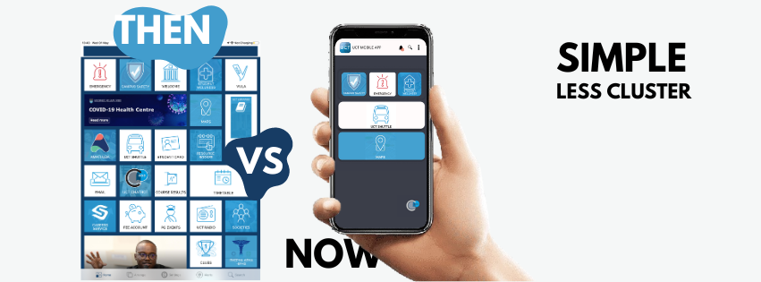

  

# UCT Mobile App Re-Design  

## Analysis and Short Report  
This report provides an analysis of the UCT mobile app, highlighting design issues and proposing solutions to improve its usability and user experience.  

We outline key design principles considered in addressing these issues and demonstrate how they have been applied in the redesign. Additionally, we include screenshots of the updated features that previously presented usability challenges.  

<!---### Key Contributions  
- Conducted UX research interviews and wrote the UX report.  
- Designed a prototype using Figma.  
- Developed the website using Wix as a content manager and React.js.  
- Designed and edited all artifacts on the website using Canva, Illustrator, and Photoshop.----->

### Key Contributions  
- Conducted UX research interviews and Wrote UX REPORT 
- Wrote UI report
- Designed a Prototype using Figma 
- Available on Github: https://github.com/ThokozaniTshabalala/UCT-MOBILE-APP-RE-DESIGN
          
## Figma Prototype  
[View the prototype here](https://www.figma.com/file/xIkA0jbZ21yT6EdJcUKgmj/UCT_MOBILE_APP_REDESIGN?type=design&node-id=0%3A1&mode=design&t=C57ElTytwxdxXZcZ-1).  

